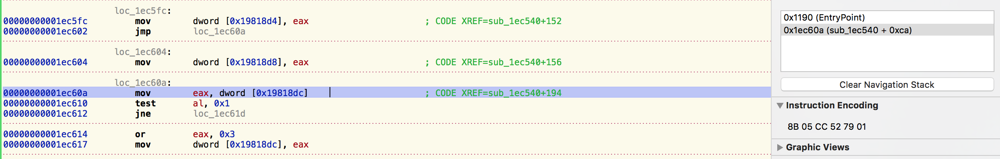

# Instruction To Offset
Converting Instruction byte code to offset on MacOS

This is simple MacOS/OSX reverse engineering tool to extract offset from instruction on specified address.

# Usage
1. Compile
2. Navigate to directory where <b>instruction_to_offset binary</b> is
3. ```sudo ./instruction_to_offset ProcessName OpCodeSize AddressOfInstruction StartAddress```<br>
<b>ProcessName</b> - Name of process<br>
<b>OpCodeSize</b> - is number of bytes in instruction, in example screenshot it's 6 bytes.<br>
<b>AddressOfInstruction</b> - is address of instruction, if it's in static module like in this example, provide static address and starting address in last parm named <b>StartAddress</b><br> 


According to screenshot example, we will get offset from instruction at address <b>0x1ec60a</b>(hopper already have that one)
```
sudo ./instruction_to_offset example_process 0x6 0x1ec60a 0x1101b9000
Instruction to Offset

Found process id: 2784
2784 -> 1103 [0 - (os/kern) successful]
OpCodeSize: 0x6
StartAddress is: 0x1101b9000
Address of instruction: 0x1ec60a
Bytes: 8b 05 cc 52 79 01 

Reversed Instruction: 17952cc
Real Offset: 0x19818dc
Result is: 0x19818dc
```
